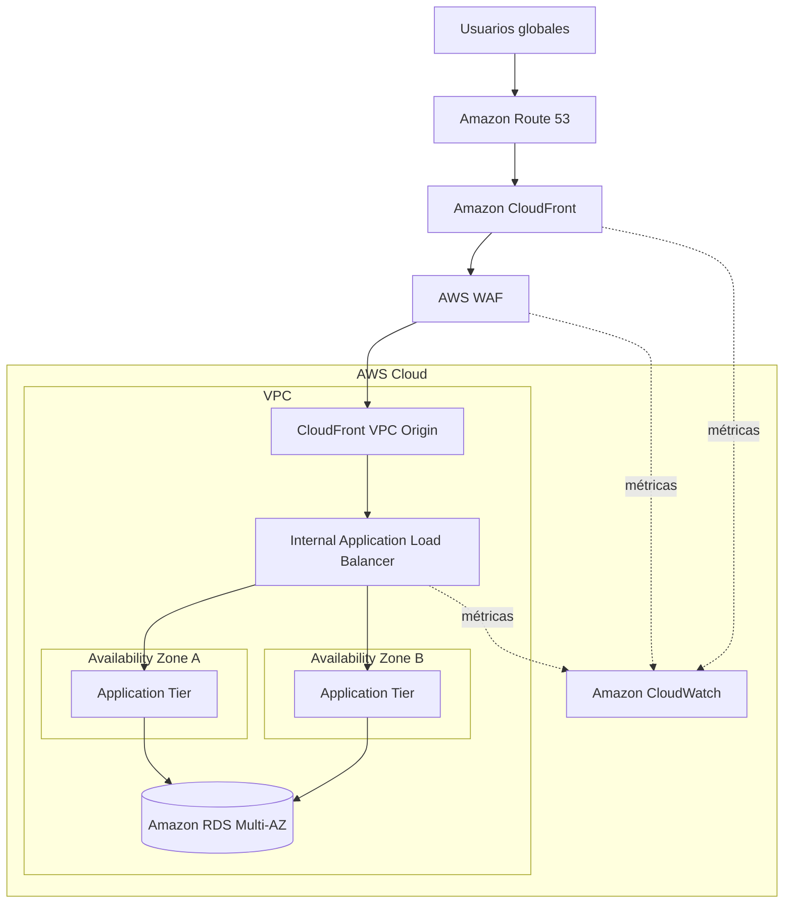

# 🌐 AWS Cloud Odyssey — Capítulo 01

# El Perímetro Global

### *Diseñando una entrada segura, privada y escalable para aplicaciones en AWS*

**Autor:** Juan Gutierrez  
**Serie:** AWS Cloud Odyssey  
**Enfoque:** Arquitecturas AWS de producción

---

Una aplicación puede funcionar perfectamente detrás de un Load Balancer público y aun así estar lejos de una arquitectura madura de producción.

En este primer capítulo de **AWS Cloud Odyssey** construiremos el perímetro de una aplicación web pensando como arquitectos: ¿dónde termina Internet?, ¿qué componente debe ser realmente público?, ¿dónde filtramos tráfico malicioso?, ¿cómo evitamos exponer el origen?, ¿cómo mantenemos alta disponibilidad y qué observamos cuando algo falla?

> **Misión:** publicar una aplicación globalmente sin convertir su infraestructura interna en una superficie pública innecesaria.

---

## 🎯 La misión

Queremos una plataforma que cumpla estas condiciones:

- acceso mediante un dominio corporativo;
- HTTPS obligatorio;
- protección de capa 7 antes de llegar a la aplicación;
- distribución global del tráfico;
- origen no expuesto directamente a Internet;
- aplicación distribuida en múltiples Availability Zones;
- capacidad de escalar horizontalmente;
- observabilidad desde el edge hasta el backend;
- diseño preparado para automatizarse con Infrastructure as Code.

---

## 🗺️ Arquitectura objetivo

<p align="center">
  
</p>

> **Arquitectura visual del capítulo.** Route 53 y CloudFront proporcionan la entrada global; AWS WAF protege la capa HTTP(S); CloudFront VPC Origin permite alcanzar un ALB interno; la aplicación se distribuye en múltiples AZ y Amazon RDS Multi-AZ protege la capa de datos.

### Diagrama técnico



### Flujo principal

```text
Usuario
   ↓
Amazon Route 53
   ↓
Amazon CloudFront
   ↓
AWS WAF
   ↓
CloudFront VPC Origin
   ↓
Internal Application Load Balancer
   ↓
Application Tier privado Multi-AZ
   ↓
Amazon RDS Multi-AZ
```

La idea central del diseño es que **CloudFront sea la puerta global y el ALB forme parte del origen privado**, en lugar de publicar innecesariamente ambos componentes.

---

# 🧠 Decisión 01 — CloudFront como entrada global

CloudFront no debe verse únicamente como una CDN para archivos estáticos. En esta arquitectura funciona como la **capa global de entrada**.

Nos aporta:

- presencia global mediante edge locations;
- terminación TLS para los usuarios;
- integración directa con AWS WAF;
- caching cuando el patrón de la aplicación lo permite;
- reducción de solicitudes que alcanzan el origen;
- una capa adicional entre Internet y nuestra aplicación.

Para contenido dinámico podemos configurar comportamientos de caché apropiados o deshabilitar caching donde no tenga sentido. El objetivo no es cachear todo: es colocar un punto de entrada global controlado.

---

# 🛡️ Decisión 02 — WAF antes del origen

Una aplicación de producción debe asumir que recibirá tráfico no deseado.

AWS WAF permite inspeccionar solicitudes HTTP(S) y aplicar controles antes de que lleguen al backend.

Una política inicial puede combinar:

```text
AWS Managed Rules
        +
Known Bad Inputs
        +
IP Reputation
        +
Rate Limiting
        +
Reglas específicas de la aplicación
```

## Estrategia de despliegue

```text
1. Asociar Web ACL
2. Managed Rules inicialmente en COUNT
3. Analizar métricas y logs
4. Identificar falsos positivos
5. Ajustar excepciones
6. Pasar progresivamente a BLOCK
```

El WAF no debe convertirse en una fuente de indisponibilidad creada por nosotros mismos.

---

# 🔒 Decisión 03 — El origen no necesita ser público

Una arquitectura tradicional puede exponer directamente el ALB:

```text
Internet → ALB público → Aplicación
```

Nuestro objetivo es:

```text
Internet
   ↓
CloudFront
   ↓
VPC Origin
   ↓
ALB interno
```

Así CloudFront se convierte en el punto público y el origen permanece dentro de la VPC.

> **Solo debe ser público aquello que realmente necesita ser público.**

---

# 🏗️ Decisión 04 — Multi-AZ desde el principio

Una aplicación de producción no debería depender de una única Availability Zone.

```text
                    Internal ALB
                         │
              ┌──────────┴──────────┐
              │                     │
             AZ-A                  AZ-B
              │                     │
         App Instance          App Instance
```

La capa de aplicación puede implementarse con:

- Amazon EC2 + Auto Scaling;
- Amazon ECS;
- Amazon EKS;
- otros targets compatibles.

En este capítulo mantenemos el runtime abierto. En capítulos posteriores llevaremos esta misma filosofía a Amazon EKS.

---

# 🗄️ Decisión 05 — Resiliencia también en datos

No tendría sentido diseñar dos zonas para la aplicación y dejar la base de datos como un único punto de falla.

Para una carga relacional tradicional podemos utilizar **Amazon RDS Multi-AZ**.

```text
Public Edge
   │
Private Application Tier
   │
Private Data Tier
```

La base de datos no necesita recibir conexiones desde Internet. Solo debe aceptar tráfico desde los componentes autorizados.

---

# 🔐 Modelo de seguridad

## Edge

**CloudFront + AWS WAF**

Objetivos:

- filtrar solicitudes maliciosas;
- limitar abuso;
- controlar patrones conocidos;
- reducir tráfico innecesario al origen.

## Red

Los Security Groups deben representar relaciones explícitas:

```text
CloudFront VPC Origin
        ↓
Internal ALB SG
        ↓
Application SG
        ↓
Database SG
```

Evitaríamos reglas como:

```text
0.0.0.0/0 → Database:5432
```

## Datos

- cifrado en tránsito;
- cifrado en reposo;
- secretos fuera del código;
- privilegios mínimos para identidades y workloads.

---

# 🔑 TLS y certificados

El usuario debe navegar siempre mediante HTTPS.

```text
https://app.example.com
```

Para CloudFront, el certificado ACM utilizado por la distribución se administra en **us-east-1**.

También podemos definir TLS entre CloudFront y el origen cuando el diseño lo requiera.

```text
HTTP → HTTPS
```

---

# 🌍 DNS con Route 53

Route 53 conecta el nombre que entiende el usuario con la distribución de CloudFront.

```text
app.example.com
      │
      ▼
Route 53 Alias
      │
      ▼
CloudFront Distribution
```

El usuario nunca necesita conocer el ALB ni la topología interna.

DNS forma parte de la arquitectura, no es un detalle que se agrega al final.

---

# 📈 Escalabilidad

La arquitectura debe crecer sin rediseñarse cada vez que aumenta la demanda.

Algunas señales típicas para escalar:

- CPU;
- memoria mediante métricas adicionales;
- request count por target;
- latencia;
- métricas de negocio;
- profundidad de colas para arquitecturas desacopladas.

Escalar solo por CPU no siempre representa la demanda real de una aplicación.

---

# 🔭 Observabilidad

Una arquitectura que no podemos observar es difícil de operar.

Como mínimo debemos poder responder:

- ¿CloudFront está entregando respuestas correctamente?
- ¿WAF está bloqueando tráfico legítimo?
- ¿aumentaron los `4xx` o `5xx`?
- ¿el ALB tiene targets unhealthy?
- ¿aumentó la latencia?
- ¿la aplicación está escalando?
- ¿la base de datos está saturada?

## Métricas clave

### CloudFront

```text
Requests
4xxErrorRate
5xxErrorRate
CacheHitRate
OriginLatency
```

### ALB

```text
RequestCount
TargetResponseTime
HTTPCode_ELB_5XX_Count
HTTPCode_Target_5XX_Count
HealthyHostCount
UnHealthyHostCount
```

### RDS

```text
CPUUtilization
DatabaseConnections
FreeStorageSpace
FreeableMemory
ReadLatency
WriteLatency
```

Las métricas importantes deben traducirse en alarmas accionables.

---

# 💰 FinOps — ¿Dónde se va el dinero?

| Componente | Driver principal de costo |
|---|---|
| CloudFront | transferencia y solicitudes |
| AWS WAF | Web ACL, reglas y requests |
| ALB | horas y LCUs |
| Compute | capacidad utilizada |
| RDS | instancia, almacenamiento, I/O y backups |
| CloudWatch | logs, métricas y retención |

La pregunta correcta no es solo “¿cuánto cuesta CloudFront?”, sino:

> **¿Cuál es el costo total de servir esta aplicación con el nivel de seguridad, rendimiento y resiliencia requerido?**

---

# ⚔️ Threat Model rápido

| Amenaza | Control principal |
|---|---|
| DDoS de infraestructura | AWS Shield Standard + edge de AWS |
| Ataques HTTP comunes | AWS WAF |
| Bots / abuso de endpoints | Rate-based rules |
| Acceso directo al origen | VPC Origin + ALB interno |
| Intercepción de tráfico | TLS |
| Movimiento lateral | segmentación + Security Groups |
| Exposición de credenciales | Secrets Manager / IAM Roles |
| Fallo de una AZ | despliegue Multi-AZ |

**AWS Shield Standard** viene incluido automáticamente para recursos AWS compatibles. **Shield Advanced** debe evaluarse según criticidad, exposición, requisitos de soporte DDoS y perfil de riesgo.

---

# 🧩 Decisiones del arquitecto

## ADR-01 — CloudFront como entrada global

**Decisión:** utilizar CloudFront delante de la aplicación.  
**Razón:** edge global, TLS, integración con WAF y posibilidad de mantener un origen privado.

## ADR-02 — ALB interno

**Decisión:** evitar un ALB Internet-facing cuando VPC Origin sea compatible con la solución.  
**Razón:** reducir superficie pública.

## ADR-03 — WAF con rollout progresivo

**Decisión:** comenzar reglas administradas sensibles en `COUNT` y promoverlas a `BLOCK` después de analizar tráfico.  
**Razón:** disminuir falsos positivos.

## ADR-04 — Multi-AZ

**Decisión:** distribuir application tier y servicios de datos según capacidades Multi-AZ.  
**Razón:** evitar que la pérdida de una única AZ detenga el servicio.

---

# 🚨 Errores que evitaría

1. **CloudFront delante de un ALB público sin restringir el origen.** Puede permitir bypass del edge.
2. **Activar WAF en BLOCK sin observar tráfico.** Puede bloquear usuarios reales.
3. **Base de datos pública por comodidad.** Aumenta superficie de exposición.
4. **Una sola AZ.** No ofrece alta disponibilidad real.
5. **Security Groups excesivamente abiertos.** Rompen el principio de mínimo privilegio.
6. **Diseñar sin logs ni alarmas.** El incidente no es el momento para descubrir que no tenemos visibilidad.

---

# 🧪 Checklist antes de producción

- [ ] Dominio administrado y registro DNS definido.
- [ ] Certificado ACM válido.
- [ ] HTTPS obligatorio para viewers.
- [ ] CloudFront configurado como entrada pública.
- [ ] Web ACL asociada a CloudFront.
- [ ] Managed Rules validadas antes de pasar a bloqueo.
- [ ] Rate limiting ajustado al comportamiento real.
- [ ] Origen privado mediante VPC Origin cuando sea compatible.
- [ ] ALB desplegado en múltiples AZ.
- [ ] Targets distribuidos entre AZ.
- [ ] Health checks probados.
- [ ] Security Groups con mínimo privilegio.
- [ ] Base de datos sin exposición pública.
- [ ] Backups y recuperación probados.
- [ ] Logs con retención definida.
- [ ] Alarmas de disponibilidad y latencia configuradas.
- [ ] Tags de costo y ownership definidos.
- [ ] Presupuesto y alertas de costo configurados.

---

# 🛠️ Infrastructure as Code

La implementación reproducible de este capítulo puede construirse con Terraform alrededor de estos bloques:

```text
ACM
Route 53
CloudFront
AWS WAF
CloudFront VPC Origin
Internal ALB
Security Groups
Application Tier
RDS
CloudWatch
```

El objetivo del código no es crear un “copy/paste mágico”, sino convertir las decisiones de arquitectura en infraestructura versionable y revisable.

---

# 🏁 Misión completada

Construimos el primer perímetro de nuestra Odyssey:

```text
Route 53
   ↓
CloudFront
   ↓
AWS WAF
   ↓
VPC Origin
   ↓
Internal ALB
   ↓
Private Application Tier
   ↓
RDS Multi-AZ
```

## Próximo destino

### 🏗️ Capítulo 02 — Construyendo para Producción

**VPC · Subnets · Multi-AZ · NAT · Load Balancing · Auto Scaling · RDS**

> **¿Cómo diseñamos una plataforma AWS que pueda perder componentes sin perder el servicio?**

---

[⬅️ Volver a AWS Cloud Odyssey](../../README.md)

---

### ✍️ Autor

**Juan Gutierrez**  
*AWS Cloud Odyssey · Arquitecturas AWS de producción*  

> Diseño y contenido técnico por Juan Gutierrez · © 2026
