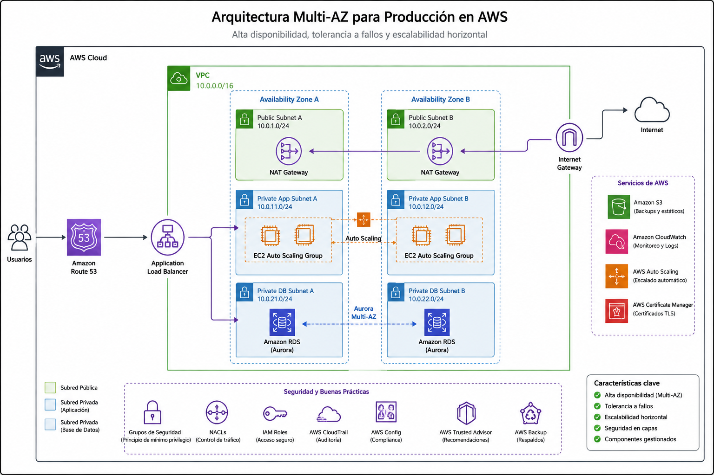

# 🏗️ AWS Cloud Odyssey — Capítulo 02

# Construyendo para Producción

### *Diseñando una plataforma Multi-AZ que pueda perder componentes sin perder el servicio*

**Autor:** Juan Gutierrez  
**Serie:** AWS Cloud Odyssey  
**Enfoque:** Arquitecturas AWS de producción

---

En producción, “tener dos servidores” no equivale a alta disponibilidad. Si ambos dependen de la misma Availability Zone, del mismo camino de salida o de una base de datos Single-AZ, seguimos teniendo puntos de falla capaces de detener el servicio.

> **Misión:** diseñar una plataforma regional que tolere la pérdida de una instancia —y esté preparada para la pérdida de una AZ— sin convertir cada capa en complejidad innecesaria.

## 🎯 Requisitos reales

- distribuir aplicación y datos entre al menos dos AZ;
- mantener compute privado y sin IP pública;
- balancear tráfico solo hacia targets saludables;
- reemplazar capacidad fallida automáticamente;
- evitar que la salida a Internet de una AZ dependa de otra;
- usar una base relacional con failover administrado;
- observar disponibilidad, saturación y capacidad, no solo CPU;
- entender el costo de cada decisión de resiliencia.

AWS Well-Architected recomienda operar workloads de producción en al menos dos AZ. Las AZ están físicamente separadas, pero conectadas con red de baja latencia, lo que permite diseñar aislamiento de fallas dentro de una Región.

---

## 🗺️ Arquitectura

<!-- IMAGE READY FOR MANUAL UPLOAD: ./arquitectura/architecture_exact_lossless.png -->
<p align="center">
  
</p>

> **Arquitectura visual del capítulo.** Un ALB distribuye solicitudes entre application subnets privadas en AZ-A y AZ-B. Un Auto Scaling Group mantiene capacidad en ambas zonas. Cada AZ utiliza su propio NAT Gateway para egress y RDS Multi-AZ mantiene un standby en una AZ distinta.

```text
Internet → ALB Multi-AZ
              │
       ┌──────┴──────┐
       │             │
      AZ-A          AZ-B
       │             │
   App/ASG        App/ASG
       │             │
    NAT-A           NAT-B
       └──────┬──────┘
              │
       RDS Multi-AZ
     Primary ⇄ Standby
```

La idea importante no es duplicar recursos: es **evitar dependencias cruzadas que vuelvan falsa la redundancia**.

---

# 🧠 Decisión 01 — Dos AZ como unidad mínima de diseño

Distribuyo el application tier en dos AZ desde el inicio. El ALB realiza health checks y deja de enviar tráfico a targets no saludables; el Auto Scaling Group repone capacidad.

**Alternativa:** una AZ reduce costo y complejidad, pero acepta explícitamente que un evento zonal pueda detener la aplicación. Es razonable para laboratorios; no es mi baseline para un servicio de producción que declara alta disponibilidad.

**Juicio práctico:** Multi-AZ no corrige una aplicación stateful mal diseñada. Sesiones locales, archivos en disco de instancia o jobs singleton pueden seguir rompiendo el failover.

# 🌐 Decisión 02 — Subnets por función, no por decoración

Por AZ separo:

- **public subnets:** ALB y NAT Gateway;
- **private application subnets:** EC2/containers;
- **private database subnets:** RDS.

Una subnet “privada” lo es por su routing, no por su nombre. El application tier no recibe una ruta directa al Internet Gateway.

# 🚪 Decisión 03 — NAT Gateway por AZ

Un NAT Gateway pertenece a una AZ. AWS advierte que si workloads de varias AZ comparten uno y esa AZ falla, las otras pueden perder salida a Internet. Para resiliencia uso un NAT por AZ y rutas privadas hacia el NAT local.

**Trade-off:** dos NAT Gateways cuestan más. Para entornos no productivos puedo aceptar uno; para producción evalúo además VPC endpoints para S3, DynamoDB y servicios AWS compatibles, reduciendo tráfico NAT y exposición de egress.

# ⚖️ Decisión 04 — ALB + Auto Scaling

El ALB desacopla el endpoint del ciclo de vida de las instancias. El ASG mantiene capacidad deseada y permite escalar horizontalmente.

No escalaría únicamente por CPU. Según el workload evaluaría `RequestCountPerTarget`, latencia, memoria, profundidad de cola o métricas de negocio.

**Sacrificio:** más automatización implica que las instancias deben ser reemplazables. Los cambios manuales dentro de una instancia dejan de ser una estrategia operativa válida.

# 🗄️ Decisión 05 — RDS Multi-AZ no es read scaling

Para una base relacional tradicional usaría RDS Multi-AZ cuando el RTO/RPO lo justifique. En el deployment Multi-AZ de DB instance, RDS mantiene un standby síncrono en otra AZ y puede hacer failover automáticamente. El standby no debe confundirse con una read replica.

AWS indica que un failover típico puede tardar aproximadamente 60–120 segundos, aunque depende de actividad y recuperación. La aplicación debe reconectar, resolver nuevamente DNS y tolerar esa interrupción: **comprar Multi-AZ no hace resiliente al cliente de base de datos por sí solo**.

---

# 🔐 Seguridad

- ALB: solo puertos publicados y TLS en producción.
- App SG: entrada únicamente desde el SG del ALB.
- DB SG: entrada únicamente desde el SG de aplicación.
- Instancias privadas sin IP pública.
- IAM role en EC2 en lugar de access keys persistentes.
- Secrets Manager/Parameter Store para secretos, no `user_data` ni repositorios.
- SSM Session Manager antes que abrir SSH administrativo a Internet.
- Cifrado EBS/RDS y TLS hacia la base cuando aplique.

La segmentación no consiste en crear muchas subnets: consiste en **hacer explícitas las relaciones permitidas**.

---

# 🧯 ¿Qué ocurre cuando algo falla?

| Falla | Comportamiento esperado | Lo que validaría |
|---|---|---|
| Una instancia | ALB deja de enrutar; ASG repone | health check y tiempo de reemplazo |
| Una AZ de app | targets de la otra AZ continúan | capacidad restante soporta carga |
| NAT de AZ-A | workloads de AZ-B conservan su NAT | rutas realmente son zonales |
| Primary RDS | RDS promueve standby | reconexión, DNS TTL, pool de conexiones |
| Deployment defectuoso | ASG puede propagarlo a ambas AZ | rolling/blue-green + rollback |

El último caso es importante: **Multi-AZ protege mejor contra fallas de infraestructura, no contra desplegar el mismo error en todas partes**.

---

# 🔭 Observabilidad operable

Yo empezaría con alarmas sobre:

```text
ALB: HealthyHostCount, UnHealthyHostCount, TargetResponseTime, HTTPCode_Target_5XX_Count
ASG/EC2: capacidad InService, CPU, status checks y memoria mediante CloudWatch Agent
NAT: ErrorPortAllocation, PacketsDropCount, BytesOutToDestination
RDS: CPUUtilization, DatabaseConnections, FreeStorageSpace, FreeableMemory, ReadLatency, WriteLatency
```

También conservaría ALB access logs cuando el caso lo requiera y eventos de RDS/Auto Scaling. Una alarma debe indicar una acción; una colección de métricas sin ownership solo crea ruido.

---

# 💰 FinOps — resiliencia tiene precio

Los principales drivers son ALB/LCU, compute mínimo en dos AZ, NAT Gateway por hora + datos procesados, transferencia inter-AZ cuando exista, y RDS Multi-AZ.

Mi decisión no sería “quitar redundancia para ahorrar”, sino preguntar **qué RTO/RPO y disponibilidad compra cada dólar adicional**. En DEV puedo usar un NAT y RDS Single-AZ; en PROD, si el negocio exige tolerancia zonal, ese ahorro sería trasladar costo financiero hacia el incidente.

---

# 🚨 Errores comunes

1. Dos instancias, pero ambas en la misma AZ.
2. Dos AZ que dependen de un único NAT Gateway.
3. RDS Multi-AZ interpretado como read replica.
4. ASG con `min_size = 1` para una aplicación que afirma ser HA.
5. Estado de sesión o archivos críticos almacenados localmente.
6. Health checks superficiales que devuelven 200 aunque dependencias estén rotas.
7. Escalar solo por CPU.
8. Diseñar failover y nunca probarlo.

---

# 🧪 Lo que validaría antes de producción

- [ ] Capacidad mínima distribuida entre al menos dos AZ.
- [ ] Subnets y route tables revisadas AZ por AZ.
- [ ] Cada private app subnet usa su NAT local o endpoints apropiados.
- [ ] Security Groups referencian otros SG donde corresponde.
- [ ] ASG reemplaza una instancia terminada sin intervención.
- [ ] La aplicación funciona si una AZ pierde todos sus targets.
- [ ] Health checks representan salud real.
- [ ] RDS failover probado y tiempo medido.
- [ ] Cliente DB reconecta después del cambio DNS.
- [ ] Backups y restore probados; HA no sustituye backup.
- [ ] Alarmas, logs, runbooks y ownership definidos.
- [ ] Costos de NAT, inter-AZ, compute y DB modelados.

---

# 🛠️ Infrastructure as Code — Terraform

El directorio [`terraform/`](./terraform/) contiene un baseline desplegable con VPC, dos AZ, subnets públicas/app/database, Internet Gateway, NAT por AZ, ALB, Auto Scaling y RDS PostgreSQL Multi-AZ. El ejemplo es deliberadamente pequeño para laboratorio; **no es una plantilla universal de producción**.

```bash
cd terraform
terraform init
terraform fmt -check
terraform validate
terraform plan
```

Antes de `apply`, define una contraseña de laboratorio mediante variable sensible y revisa costos. No reutilices credenciales reales.

---

# 🏁 Lección del capítulo

Alta disponibilidad no es contar recursos. Es revisar **qué dependencia compartida puede derribar simultáneamente las copias que creemos independientes**.

Mi baseline regional empieza por dos AZ, pero la decisión final siempre vuelve al negocio: RTO, RPO, patrón de tráfico, estado de la aplicación, madurez operativa y presupuesto.

## Próximo destino

### ☸️ Capítulo 03 — Kubernetes a Escala — Amazon EKS

---

[⬅️ Volver a AWS Cloud Odyssey](../../README.md)

**Juan Gutierrez** · AWS Cloud Odyssey · Multi-AZ · Reliability · VPC · Auto Scaling · RDS · Terraform