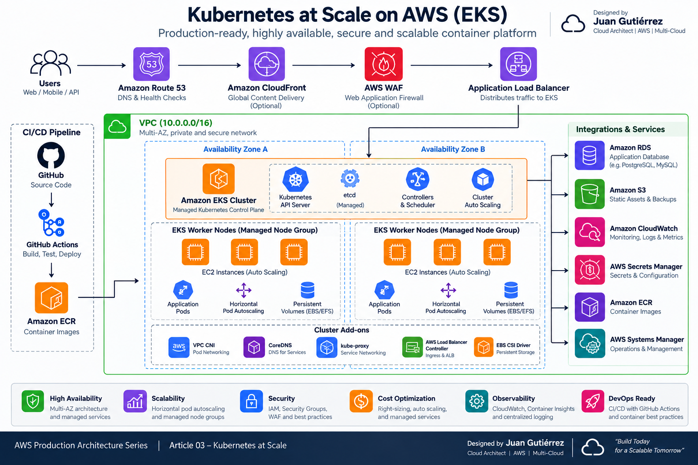

# ☸️ AWS Cloud Odyssey — Capítulo 03

# Kubernetes a Escala — Amazon EKS

### *Diseñando una plataforma de contenedores que siga siendo operable cuando crezcan los equipos, los nodos y los fallos*

**Autor:** Juan Gutierrez  
**Serie:** AWS Cloud Odyssey  
**Enfoque:** Arquitecturas AWS de producción

---

EKS resuelve una parte difícil: operar el control plane de Kubernetes. No resuelve por nosotros el direccionamiento IP, la distribución de Pods, los permisos de workloads, la estrategia de nodos, los upgrades ni el costo de capacidad ociosa. En proyectos reales, los problemas aparecen precisamente en esas fronteras.

> **Misión:** diseñar una plataforma EKS regional, privada y Multi-AZ que pueda escalar aplicaciones y capacidad sin convertir el cluster en un conjunto de excepciones manuales.

## 🎯 Requisitos reales

- distribuir nodos y réplicas entre al menos dos AZ;
- mantener workers en subnets privadas y limitar el acceso al API server;
- separar identidad humana de identidad de workloads;
- escalar Pods por demanda y nodos por capacidad pendiente;
- evitar que una interrupción voluntaria elimine demasiadas réplicas a la vez;
- restringir tráfico east-west y privilegios de contenedores;
- centralizar logs, métricas y auditoría;
- hacer upgrades y reemplazos de nodos repetibles;
- controlar costo sin sacrificar el dominio de falla.

AWS recomienda desplegar EKS en múltiples AZ y usar controles de topología para distribuir Pods. Para clusters nuevos, la guía actual también favorece EKS Cluster Access Management (access entries) y EKS Pod Identity para workloads compatibles.

---

## 🗺️ Arquitectura

<p align="center">
  
</p>

> **Arquitectura visual del capítulo.** Un ALB administrado por AWS Load Balancer Controller publica los servicios. El control plane administrado de EKS se conecta a workers privados distribuidos en tres AZ. Un Managed Node Group pequeño sostiene componentes críticos de plataforma y Karpenter incorpora capacidad dinámica para workloads. EKS Pod Identity entrega credenciales temporales por aplicación; CloudWatch y CloudTrail cubren observabilidad y auditoría.

---

# 🧠 Decisión 01 — El cluster no es la unidad de alta disponibilidad

EKS administra un control plane altamente disponible, pero una aplicación puede seguir siendo frágil si sus tres réplicas terminan en el mismo nodo o AZ. Por eso diseño disponibilidad en dos capas: infraestructura y scheduling.

Para producción prefiero tres AZ cuando la Región y el presupuesto lo permiten. En el Deployment uso `topologySpreadConstraints` por `topology.kubernetes.io/zone` y `kubernetes.io/hostname`. Para servicios críticos añado PodDisruptionBudget.

**Trade-off:** más AZ mejora tolerancia a fallas, pero puede aumentar transferencia inter-AZ y complejidad de storage. No fuerzo distribución indiscriminadamente en workloads que generan grandes volúmenes de tráfico entre réplicas sin medir ese costo.

---

# 🧠 Decisión 02 — Managed Node Group estable + Karpenter dinámico

No pondría todos los huevos en el autoscaler. Mantengo un Managed Node Group pequeño, On-Demand y Multi-AZ para add-ons y componentes de plataforma. Karpenter atiende capacidad variable de aplicaciones y puede elegir tipos de instancia según restricciones declaradas.

Esto evita una dependencia circular: el componente que crea nodos no debería depender exclusivamente de nodos que él mismo crea. También permite combinar una base predecible con Spot donde el workload tolere interrupciones.

**Alternativa:** Cluster Autoscaler con Managed Node Groups sigue siendo válida y puede ser más simple para equipos que ya operan grupos definidos. Karpenter gana flexibilidad y velocidad de provisioning; a cambio exige disciplina en NodePools, límites, disruption y selección de instancias.

---

# 🧠 Decisión 03 — Acceso humano y acceso de Pods son problemas distintos

Para administradores uso IAM Identity Center + EKS access entries y RBAC de mínimo privilegio. Evito usuarios IAM permanentes y no dejo `cluster-admin` como permiso cotidiano.

Para aplicaciones uso **EKS Pod Identity** cuando el runtime es compatible, con un IAM role por aplicación. No entrego permisos AWS al node role esperando que los Pods “hereden” acceso: eso amplía el blast radius.

IRSA sigue siendo una alternativa soportada, especialmente cuando existen requisitos o runtimes no compatibles con Pod Identity.

---

# 🧠 Decisión 04 — Endpoint y red: privado por defecto

Workers viven en subnets privadas. Para el API endpoint prefiero acceso privado; si una organización necesita acceso público, lo limito a CIDRs corporativos conocidos y mantengo autenticación/autorización estricta.

El VPC CNI integra Pods con la red VPC, pero IPs también son capacidad. Antes de producción calculo crecimiento de Pods, prefijos/subnets y límites de ENI. Un cluster puede tener CPU libre y aun así fallar scheduling por agotamiento de IPs.

Habilito Network Policy del VPC CNI y parto de deny-by-default para namespaces sensibles, abriendo solo flujos necesarios.

---

# 🛡️ Seguridad

- EKS access entries + RBAC; sin credenciales humanas estáticas.
- EKS Pod Identity/IRSA con roles por workload y mínimo privilegio.
- Secrets cifrados con KMS cuando el modelo de riesgo lo requiere; secretos externos para rotación administrada.
- imágenes desde ECR con escaneo y pipeline de promoción.
- `runAsNonRoot`, `allowPrivilegeEscalation: false`, filesystem read-only cuando la aplicación lo permita.
- Pod Security Standards/policy-as-code para impedir configuraciones privilegiadas.
- Network Policies para reducir movimiento lateral.
- CloudTrail y control-plane audit logs para investigación.

---

# 🧯 Resiliencia

Un `replicas: 3` no garantiza resiliencia. Valido distribución real, requests/limits, probes y comportamiento durante drains.

```yaml
spec:
  replicas: 3
  template:
    spec:
      topologySpreadConstraints:
        - maxSkew: 1
          topologyKey: topology.kubernetes.io/zone
          whenUnsatisfiable: DoNotSchedule
          labelSelector:
            matchLabels:
              app: api
```

Para workloads críticos pruebo pérdida de un nodo y de capacidad de una AZ. Un PDB protege contra disrupciones **voluntarias**; no reemplaza réplicas, anti-affinity ni recuperación de fallas involuntarias.

---

# 🔭 Observabilidad

No considero EKS observable solo porque `kubectl get pods` muestre `Running`. Monitorizo cuatro planos:

1. **Aplicación:** latencia, errores, throughput y métricas de negocio.
2. **Kubernetes:** Pending Pods, restarts, OOMKilled, scheduling, HPA, PDB y eventos.
3. **Nodos/red:** CPU/memoria, disco, presión, IPs disponibles, errores CNI y capacidad por AZ.
4. **Control y seguridad:** API audit, autenticación, cambios IAM, CloudTrail y hallazgos de seguridad.

CloudWatch Container Insights es una base razonable; Prometheus/Grafana u OpenTelemetry pueden complementar cuando se necesita portabilidad o métricas específicas.

---

# 💰 Costos y FinOps

Los costos que reviso no son solo el precio del cluster:

- EC2/Fargate y porcentaje real de utilización;
- NAT Gateway y transferencia de datos;
- ALB/NLB;
- CloudWatch Logs y retención;
- EBS/EFS;
- transferencia inter-AZ;
- capacidad On-Demand vs Spot.

Spot es excelente para workers tolerantes a interrupciones, pero no lo convierto en una regla universal. La decisión correcta depende de PDB, tiempos de arranque, statefulness y capacidad de reintento.

---

# ⚙️ Operación y upgrades

Trato upgrades como un proceso de plataforma: revisar versión y add-ons, APIs deprecadas, compatibilidad de controllers, crear/reemplazar capacidad, drenar gradualmente, validar SLO y recién retirar nodos anteriores. No actualizo control plane, CNI, CoreDNS, kube-proxy y todos los workers a ciegas en una sola acción.

Mantengo add-ons explícitos en IaC y pruebo cambios en un ambiente representativo. Para cambios mayores, blue/green de cluster puede costar más pero reduce el riesgo de una actualización in-place difícil de revertir.

---

# ⚠️ Errores comunes

- creer que EKS administrado significa Kubernetes sin operación;
- un único node group para plataforma y todas las aplicaciones;
- Pods sin requests/limits y luego culpar al autoscaler;
- tres réplicas concentradas en una AZ;
- otorgar permisos AWS al node role para resolver rápidamente un acceso de aplicación;
- endpoint público abierto a `0.0.0.0/0`;
- no presupuestar IPs del VPC CNI;
- PDB demasiado estricto que bloquea upgrades;
- usar Spot para componentes que no toleran interrupción;
- retener todos los logs indefinidamente.

---

# 🧪 Qué valido antes de producción

- [ ] ¿Los subnets cubren 2–3 AZ y tienen espacio IP suficiente?
- [ ] ¿El endpoint del cluster tiene el mínimo alcance necesario?
- [ ] ¿Administradores entran mediante access entries/RBAC?
- [ ] ¿Cada workload AWS tiene Pod Identity/IRSA de mínimo privilegio?
- [ ] ¿Réplicas críticas se distribuyen entre zonas y hosts?
- [ ] ¿Requests, limits, HPA y PDB fueron probados bajo carga?
- [ ] ¿Karpenter/Cluster Autoscaler tiene límites y capacidad de fallback?
- [ ] ¿Network Policies y Pod Security están aplicados?
- [ ] ¿Logs del control plane, métricas y alertas tienen retención definida?
- [ ] ¿Se probó drain, pérdida de nodo y recuperación de una AZ?
- [ ] ¿Existe runbook de upgrade y rollback?
- [ ] ¿Se midieron NAT, transferencia inter-AZ y logging?

---

# 🧱 Baseline Terraform

El directorio [`terraform/`](./terraform/) contiene una base desplegable: VPC Multi-AZ, subnets públicas/privadas, NAT por AZ, cluster EKS con endpoint privado, access entries, Managed Node Group y add-ons esenciales. Es deliberadamente un **baseline**, no una plataforma universal.

Antes de usarlo en producción agregaría según contexto: Karpenter, AWS Load Balancer Controller, ExternalDNS, secrets integration, observabilidad, GitOps y políticas organizacionales.

---

# 🧭 Lección de arquitectura

La escala en Kubernetes no empieza cuando aparecen cien nodos. Empieza cuando dejamos de depender de decisiones manuales para que el siguiente nodo, Pod, permiso, upgrade o falla se comporte de forma predecible.

Mi criterio es sencillo: **si para recuperar una réplica necesito recordar en qué AZ, node group o role “solía funcionar”, la plataforma todavía no está diseñada para escala.**

---

## 📚 Referencias oficiales

- Amazon EKS Best Practices Guide — VPC and Subnet Considerations
- Amazon EKS Best Practices Guide — Identity and Access Management
- Amazon EKS Best Practices Guide — Cluster Access Management
- Amazon EKS Best Practices Guide — Karpenter
- Amazon EKS Best Practices Guide — Running highly-available applications
- Amazon EKS Best Practices Guide — Network Security
- Amazon EKS Best Practices Guide — Pod Security

---

**Juan Gutierrez**  
Solutions Architect · Cloud Architecture · Kubernetes · Security · FinOps · Cloud Modernization
