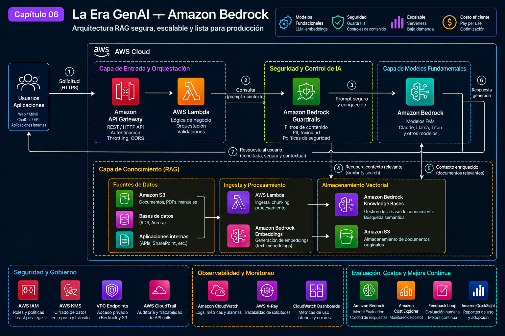

# 🤖 AWS Cloud Odyssey — Capítulo 06

# La Era GenAI — Amazon Bedrock

### *Llevando RAG a producción: grounding, guardrails, capacidad y operación antes que una demo bonita*

**Autor:** Juan Gutierrez  
**Serie:** AWS Cloud Odyssey  
**Enfoque:** Arquitecturas AWS de producción

---

Una demo GenAI puede impresionar con diez documentos y un prompt. Producción empieza cuando la respuesta debe respetar permisos, citar evidencia, sobrevivir a throttling, controlar costo por conversación y permitir explicar por qué el sistema respondió algo. Mi punto de partida no es el modelo: es el riesgo de negocio.

> **Misión:** diseñar un asistente empresarial con Amazon Bedrock que use RAG para conocimiento privado, aplique controles antes y después de la inferencia, y pueda medirse, degradarse y operarse como cualquier sistema crítico.

## 🎯 Requisitos reales

- respuestas sustentadas en conocimiento autorizado y trazable;
- aislamiento de datos, mínimo privilegio y cifrado;
- defensa ante contenido no permitido y exposición de información sensible;
- control de latencia, tokens, concurrencia y cuotas;
- tolerancia a fallos transitorios sin tormentas de reintentos;
- evaluación offline antes del release y telemetría online;
- versionado de prompts, fuentes y configuración;
- costo atribuible por aplicación/caso de uso;
- decisión explícita sobre residencia de datos antes de usar inferencia cross-Region.

---

## 🗺️ Arquitectura

  

El patrón separa **plano de aplicación**, **plano de conocimiento** y **plano de control**. API Gateway/Lambda autentican, autorizan y construyen la solicitud. Bedrock Guardrails inspecciona entrada/salida. Knowledge Bases recupera contexto desde documentos gobernados; el modelo genera la respuesta usando ese contexto. CloudWatch/CloudTrail y un pipeline de evaluación permiten observar calidad, seguridad, latencia y costo sin registrar indiscriminadamente prompts sensibles.

---

# 🧠 Decisión 01 — RAG antes que “enseñarle todo al modelo”

Para conocimiento empresarial cambiante prefiero RAG: documentos versionados en S3, ingesta controlada, embeddings y recuperación antes de generar. Eso desacopla el ciclo de actualización documental del ciclo del modelo y permite devolver evidencia/citas.

No uso RAG por dogma. Si el caso solo necesita razonamiento general, añadir retrieval agrega latencia y costo. Si necesito comportamiento especializado y estable, evalúo prompt engineering, model customization o fine-tuning según el modelo/caso. **RAG resuelve grounding; no convierte una respuesta en verdad.**

El chunking, metadata filters, número de resultados y calidad documental se prueban con preguntas reales. Recuperar más fragmentos puede mejorar recall y a la vez empeorar precisión, tokens y latencia.

---

# 🧠 Decisión 02 — El modelo es una dependencia intercambiable

La aplicación no conoce detalles de un proveedor de modelo en cada capa. Encapsulo inferencia detrás de un contrato y uso Converse cuando encaja para reducir acoplamiento. Mantengo un conjunto de evaluación por caso de uso para comparar calidad, latencia y costo antes de cambiar modelo.

El modelo más grande no gana automáticamente. Para clasificación, extracción o respuestas simples, un modelo menor puede cumplir SLO a menor costo/latencia. Para tareas complejas acepto más costo si la evaluación demuestra valor.

**Trade-off:** abstraer facilita sustitución, pero esconder todas las capacidades específicas detrás del mínimo común denominador también puede desperdiciar funciones útiles. La abstracción debe aislar dependencia, no negar diferencias.

---

# 🧠 Decisión 03 — Guardrails es una capa, no toda la seguridad

Bedrock Guardrails puede evaluar prompts y respuestas con políticas de contenido, temas denegados, información sensible y otros controles. Lo aplico como defensa adicional; autenticación, autorización, control de acceso a fuentes y validación de acciones siguen siendo responsabilidad de la aplicación.

Una respuesta bloqueada es un resultado operativo que debe medirse. Ajusto políticas con casos positivos/negativos para evitar tanto bypass como falsos positivos. Para RAG, el usuario solo debe recuperar contenido que esté autorizado a consultar: **filtrar después de recuperar es demasiado tarde**.

---

# 🧠 Decisión 04 — Diseñar capacidad antes del lanzamiento

Mido tokens de entrada/salida, concurrencia, latencia p50/p95/p99 y errores de capacidad. Los retries son acotados con backoff/jitter. Ante 503/529 sostenidos no aumento reintentos indefinidamente: reduzco ramp-up, limito concurrencia y aplico cola/degradación.

Cuando el modelo lo soporta, cross-Region inference puede mejorar throughput y resiliencia; pero prompts/respuestas pueden procesarse fuera de la Región origen dentro de la geografía definida. Eso se valida primero con residencia/compliance. Para carga sostenida y predecible evalúo Provisioned Throughput.

---

# 🧠 Decisión 05 — Evaluar antes de confiar

No promuevo un cambio de prompt/modelo porque “se ve mejor”. Mantengo un dataset representativo con respuesta esperada o criterios de evaluación: groundedness, relevancia, completitud, seguridad, formato, latencia y costo.

Separo métricas de plataforma de métricas de calidad. Un endpoint con 99.9% de disponibilidad que responde convincentemente mal sigue siendo un incidente de producto.

---

# 🔐 Seguridad

- IAM por workload; sin access keys embebidas.
- VPC endpoints/PrivateLink cuando el patrón de red y servicio lo requiera.
- S3 y stores cifrados; KMS cuando se necesita control de clave/política.
- Secrets Manager para secretos de integraciones externas.
- autorización antes de retrieval y metadata filters cuando corresponda;
- Guardrails sobre entrada/salida, sin sustituir autorización;
- CloudTrail para actividad API y controles organizacionales para limitar modelos/Regiones;
- prompts/logs tratados como datos potencialmente sensibles; redacción y retención mínima.

---

# 🧯 Resiliencia

Defino timeout total del journey y presupuestos por retrieval/inference. Uso retries solo para fallos transitorios y evito duplicar acciones con efectos laterales. Si GenAI es una mejora y no la función esencial, diseño degradación: búsqueda tradicional, respuesta cacheada aprobada o mensaje claro de indisponibilidad.

Para acciones agentic aplicaría allowlists, scopes mínimos y human-in-the-loop para operaciones de alto impacto. El modelo propone; una capa determinística autoriza y ejecuta.

---

# 🔭 Observabilidad

Correlaciono `requestId`, sesión, versión de prompt, modelo/inference profile y versión del índice sin guardar contenido sensible por defecto. Observo:

- latencia de API, retrieval e inferencia;
- tokens de entrada/salida y costo estimado;
- throttling/5xx y retries;
- intervenciones de Guardrails;
- calidad de retrieval y respuestas sin evidencia;
- feedback/evaluaciones por versión;
- ingestiones fallidas y freshness de fuentes.

CloudWatch concentra métricas/alarmas y CloudTrail aporta auditoría API. Los dashboards deben responder si empeoró **el servicio o la calidad**.

---

# 💰 Costos y FinOps

El costo real incluye inferencia por tokens, embeddings, almacenamiento/vector search, ingesta, Guardrails, logs y red. Etiqueto/aplico perfiles de inferencia por aplicación cuando necesito atribución y comparo costo por conversación resuelta, no solo costo por millón de tokens.

Reducir contexto inútil, limitar output, cachear cuando sea seguro y seleccionar un modelo adecuado suele valer más que micro-optimizar Lambda. Provisioned Throughput solo tiene sentido cuando utilización/SLO justifican capacidad comprometida.

---

# ⚙️ Operación

- prompts, guardrails e IaC versionados;
- dataset de evaluación en CI/CD antes de promover;
- canary/A-B para cambios de modelo o prompt;
- runbook para throttling, degradación de retrieval y respuestas inseguras;
- proceso de reingesta y rollback del índice;
- cuotas y límites revisados antes de campañas/lanzamientos;
- owner para fuentes y política de freshness;
- cambios de Región/modelo revisados contra compliance.

---

# ⚠️ Errores comunes

- escoger el modelo antes de definir el problema;
- confundir RAG con garantía de exactitud;
- meter todos los documentos en contexto;
- recuperar información y recién después validar acceso;
- loggear prompts/respuestas completos en producción;
- retries ilimitados ante falta de capacidad;
- usar cross-Region sin revisar residencia;
- medir uptime pero no calidad;
- dejar prompts/guardrails fuera de control de versiones;
- permitir que un agente ejecute acciones críticas sin autorización determinística.

---

# 🧪 Qué valido antes de producción

- [ ] ¿Existe un dataset de evaluación representativo y criterios de aceptación?
- [ ] ¿Retrieval respeta autorización antes de devolver contexto?
- [ ] ¿Guardrails fue probado contra abuso y falsos positivos?
- [ ] ¿Prompt, modelo, inference profile e índice son versionables/trazables?
- [ ] ¿p95/p99 y tokens cumplen el SLO/presupuesto?
- [ ] ¿Retries son acotados y la concurrencia protege capacidad/downstreams?
- [ ] ¿La decisión de cross-Region cumple residencia y políticas IAM/SCP?
- [ ] ¿Existe degradación cuando inference/retrieval falla?
- [ ] ¿Logs evitan PII/secretos y tienen retención definida?
- [ ] ¿Se puede atribuir costo por aplicación/caso de uso?
- [ ] ¿Se probó rollback de prompt/modelo/fuente?
- [ ] ¿Las acciones de alto impacto requieren autorización fuera del LLM?

---

# 🧱 Baseline Terraform

[`terraform/`](./terraform/) crea un Guardrail versionado y un rol de ejecución mínimo para una aplicación que invoca Bedrock. Es deliberadamente pequeño: la base de conocimiento, vector store y API dependen de requisitos de datos/red. El objetivo es que el primer despliegue ya trate seguridad y permisos como código.

---

# 🧭 Lección de arquitectura

Mi regla práctica: **una aplicación GenAI está lista para producción cuando puedo explicar qué sabe, qué puede hacer, qué no puede ver, cuánto cuesta y cómo falla**. El modelo es importante; el sistema alrededor determina si puedo confiar en él.

---

## 📚 Referencias oficiales

- Amazon Bedrock — Guardrails y políticas de entrada/salida
- Amazon Bedrock — Knowledge Bases / RAG
- Amazon Bedrock — Scaling and throughput best practices
- Amazon Bedrock — Inference profiles y cross-Region inference
- AWS Well-Architected — Generative AI Lens

---

**Juan Gutierrez**  
Solutions Architect · Cloud Architecture · Kubernetes · Security · FinOps · Cloud Modernization